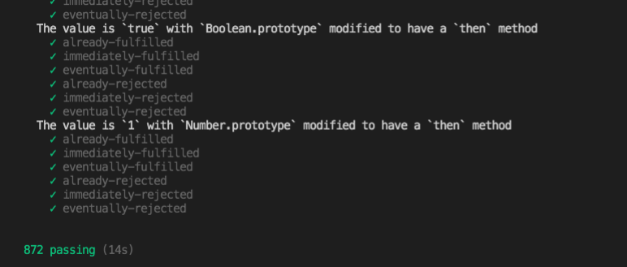

# 读懂 Promises/A+规范，你也可以轻松实现一个 Promises！

# 前言

Promise 是异步编程的一种解决方案，比传统的解决方案 Callback 更合理和更强大。Promise 最大的好处是在异步执行的流程中，把执行代码和处理结果的代码清晰地分离了。目前社区有很多版本的手写 Promise 源码的版本，但是对于不熟悉 Promise 规范的同学来说还是不好理解。本文我将带你一起读懂 Promises/A+规范，并且依据规范编写能通过 promises-aplus-tests 提供的 **872** 个测试用例。相信读完这篇文章的你最终会感觉到实现 Promise 是如此的简单！

# 规范解读

[Promises/A+规范](https://promisesaplus.com/)

## 1.术语

- 1.1 Promise 是一个具有 then 方法的对象或函数。
- 1.2 Thenable 是定义 then 方法的对象或函数。
- 1.3 value 是任何合法的 JavaScript 值(包括 undefined、thenable 或 promise)。
- 1.4 异常是使用 throw 语句抛出的值。
- 1.5 Reason 是一个值，它表示承诺被拒绝的理由。

## 2.规范要求

**(ps: 最重要的是看懂这部分，然后就能根据规范指导来实现 Promise 。)**

promise 对象必须处于以下三种状态之一: pending（待定的），fulfilled（已完成），rejected（被拒绝）

### 2.1. Promise 状态值

- 2.1.1 当等待时，承诺:可以转换为已完成或被拒绝状态。
- 2.1.2 当一个承诺被实现时其状态值只能是 fulfilled（已完成）或者 rejected（被拒绝）

### 2.2. Promise.then 方法

promise 必须提供 then 方法来访问其当前或最终值或理由。promise.then 方法接受两个参数

```js
promise.then(onFulfilled, onRejected);
```

- 2.2.1 onFulfilled 和 onRejected 都是可选参数:如果 onFulfilled 不是一个函数，它必须被忽略。如果 onRejected 不是一个函数，则必须忽略它。
- 2.2.2 如果 onFulfilled 是一个函数:它必须在 promise 完成后被调用，promise 的值作为它的第一个参数。在承诺兑现之前绝不能调用它。并且它不能被多次调用。
- 2.2.3 如果 onRejected 是一个函数，它必须在 promise 被拒绝后调用，promise 的 reason 作为它的第一个参数。在承诺被拒绝之前绝不能调用它。并且它不能被多次调用。
- 2.2.4 确保 onFulfilled 和 onRejected 在调用 then 的事件循环之后执行，并使用新的堆栈。（其实就是指在 then 方法的本轮事件循环之后执行）
- 2.2.5 onFulfilled 和 onRejected 必须是函数。
- 2.2.6 then 方法可以在同一个 promise 上多次调用。如果当承诺被履行，所有相应的 onFulfilled 回调必须按照它们对 then 的原始调用的顺序执行。如果当承诺被拒绝时，所有相应的 onRejected 回调必须按照它们对 then 的原始调用的顺序执行。
- 2.2.7 then 方法必须返回一个 promise （可以支持链式调用：promise2 = promise1.then(onFulfilled, onRejected);）
  - 2.2.7.1 如果 onFulfilled 或 onRejected 返回值是 x，运行 Promise 的解析函数[[Resolve]](promise2, x)。
  - 2.2.7.2 如果 onFulfilled 或 onRejected 抛出一个异常 e, promise2 必须以 e 为理由被拒绝。
  - 2.2.7.3 如果 onFulfilled 不是一个函数，并且 promise1 被 resolve，那么 promise2 必须以与 promise1 相同的值被 resolve。
  - 2.2.7.4 如果 onRejected 不是一个函数，并且 promise1 被拒绝，则 promise2 必须以与 promise1 相同的理由被拒绝。

代码实现：

```js
const PENDING = "pending";
const FULFILLED = "fulfilled";
const REJECTED = "rejected";

class MyPromise {
  status = PENDING; //初始状态
  reason = null; //失败的值
  value = null; //成功的值
  onFulfilledCallbacks = []; //存放成功回调
  onRejectedCallbacks = []; //存放失败回调

  constructor(executor) {
    if (typeof executor !== "function") {
      throw new Error(
        `Uncaught TypeError: MyPromise resolver <${typeof executor}> is not a function`
      );
    }
    //resolve的作用是将promise的状态变成fulfilled并且执行异步任务
    const resolve = (value) => {
      if (this.status === PENDING) {
        this.status = FULFILLED;
        this.value = value;
        while (this.onFulfilledCallbacks.length) {
          //清空当前的成功回调函数
          this.onFulfilledCallbacks.shift()();
        }
      }
    };
    //reject的作用是将promise的状态变成rejected并且执行异步任务
    const reject = (reason) => {
      if (this.status === PENDING) {
        this.status = REJECTED;
        this.reason = reason;
        while (this.onRejectedCallbacks.length) {
          //清空当前的失败回调函数
          this.onRejectedCallbacks.shift()();
        }
      }
    };
    //使用try、catch来捕获执行器中的错误，并且在执行错误的时候将Promise的状态变为失败
    try {
      executor(resolve, reject);
    } catch (e) {
      reject(e);
    }
  }

  /**
   * then方法实现逻辑
   * 1、then方法中的参数是可选的
   * 2、当状态为 FULFILLED 时执行 onFulfillment，状态为 REJECTED 时执行 onRejected, 返回一个新 MyPromise 供链式调用
   * 3、onFulfilled和onRejected两个函数必须在then的事件循环之后被调用
   */
  then(onFulfilled, onRejected) {
    // 提供默认参数以便可以让then的值"穿透"
    onFulfilled =
      typeof onFulfilled === "function" ? onFulfilled : (value) => value;
    onRejected =
      typeof onRejected === "function"
        ? onRejected
        : (reason) => {
            throw reason;
          };

    // then 方法实现链式调用
    //确保 onFulfilled 和 onRejected 在调用 then 的事件循环之后，并使用新的堆栈。所以需要包裹一层 queueMicrotask 来使用新的堆栈执行任务
    const promise2 = new MyPromise((resolve, reject) => {
      if (this.status === FULFILLED) {
        // 这可以用宏任务机制(如setTimeout或setImmediate)来实现，也可以用微任务机制(如MutationObserver或process.nextTick)来实现。
        // 这里我使用了queueMicrotask 来确保 onFulfilled 和 onRejected 在事件循环调用之后异步执行
        queueMicrotask(() => {
          //如果onFulfilled或onRejected抛出一个异常e,promise2 必须被拒绝（rejected）并把e当作原因
          try {
            const x = onFulfilled(this.value);
            resolvePromise(promise2, x, resolve, reject);
          } catch (e) {
            reject(e);
          }
        });
      } else if (this.status === REJECTED) {
        queueMicrotask(() => {
          try {
            const x = onRejected(this.reason);
            resolvePromise(promise2, x, resolve, reject);
          } catch (e) {
            reject(e);
          }
        });
      } else if (this.status === PENDING) {
        //如果是同一实例多次调用then方法则需要保存回调函数，等将来按顺序调用
        this.onFulfilledCallbacks.push(() => {
          queueMicrotask(() => {
            try {
              const x = onFulfilled(this.value);
              resolvePromise(promise2, x, resolve, reject);
            } catch (e) {
              reject(e);
            }
          });
        });
        this.onRejectedCallbacks.push(() => {
          queueMicrotask(() => {
            try {
              const x = onRejected(this.reason);
              resolvePromise(promise2, x, resolve, reject);
            } catch (e) {
              reject(e);
            }
          });
        });
      }
    });
    return promise2;
  }
}
```

### 2.3 Promise 的解决程序 （resolvePromise）

承诺解析过程是一个抽象操作，将承诺和值作为输入，我们将其表示为 [[Resolve]](promise, x)。 如果 x 是一个 thenable，它会尝试让 promise 获取 x 的状态，假设 x 的行为至少有点像 promise。 否则，它以值 x 履行承诺。

对 thenables 的这种处理允许 promise 实现递归。

要运行 [[Resolve]](promise, x)，请遵守以下步骤：

- 2.3.1 如果 promise 实例和 x 指向同一个对象，则以 T ypeError 作为拒绝 promise 的理由。
- 2.3.2 如果 x 是 pending 的状态，promise 必须保持 pending 直到 x 被完成或拒绝。如果当 x 完成时，用相同的值完成承诺。如果当 x 被拒绝时，以同样的理由拒绝承诺。
- 2.3.3 否则，如果 x 是一个对象或函数，则先尝试获取 x.then。
  - 2.3.3.1 如果检索属性 x.then 导致抛出异常 e，则以 e 为原因拒绝 promise。
  - 2.3.3.2 如果 then 是一个函数，则使用 x 作为 this 调用它，第一个参数是 resolvePromise，第二个参数是 rejectPromise
  - 2.3.3.3 如果当使用值 y 调用 resolvePromise 时，运行 [[Resolve]](promise, y)。
  - 2.3.3.4 如果当以原因 r 调用 rejectPromise，则用 r 拒绝 promise。
  - 2.3.3.5 如果同时调用了 resolvePromise 和 rejectPromise，或者对同一个参数进行了多次调用，则第一个调用优先，任何进一步的调用都将被忽略。
- 2.3.4 如果 x 既不是对象也不是函数，用 x 完成(fulfill)

代码实现：

```js
/**
 * MyPromise 的处理流程函数
 * then 方法里面 return 一个返回值作为下一个 then 方法的参数
 * 如果是 return 一个 MyPromise 对象，那么就需要判断它的状态
 * 如果 then 方法返回的是自己的 MyPromise 对象，则会发生循环调用，这个时候程序会报错
 * */
function resolvePromise(promise2, x, resolve, reject) {
  if (promise2 === x) {
    return reject(
      new TypeError("Chaining cycle detected for promise #<MyPromise>")
    );
  }
  //通过 called 来控制，如果同时调用resolvePromise和rejectPromise，或者对同一参数进行多次调用，则第一个调用优先，其他调用将被忽略。
  let called = false;
  //Otherwise, if x is an object or function
  if (
    x !== null &&
    (Object.prototype.toString.call(x) === "[object Object]" ||
      typeof x === "function")
  ) {
    //如果取回的 x.then 属性的结果为一个异常 e,用 e 作为原因reject promise
    //例如例如 x 对象有一个属性 then 被使用了 Object.defineProperty(x, 'then',  get() { throw new Error('err') })
    //如果then是一个方法，把 x 当作 this 来调用它，第一个参数为 resolvePromise，第二个参数为 rejectPromise
    try {
      let then = x.then;
      if (typeof then === "function") {
        then.call(
          x,
          (y) => {
            if (called) return;
            called = true;
            //递归执行,并且每次都是一个新的promise实例
            resolvePromise(promise2, y, resolve, reject);
          },
          (r) => {
            if (called) return;
            called = true;
            reject(r);
          }
        );
      } else {
        if (called) return;
        called = true;
        resolve(x);
      }
    } catch (e) {
      if (called) return;
      called = true;
      reject(e);
    }
  } else {
    // 如果x既不是对象也不是函数，用x完成(fulfill)
    resolve(x);
  }
}
```

# 实现 Promise.resolve()

Promise.resolve(value)方法返回一个以给定值解析后的 Promise 对象。如果这个值是一个 promise ，那么将返回这个 promise ；如果这个值是 thenable（即带有"then" 方法），返回的 promise 会“跟随”这个 thenable 的对象，采用它的最终状态；否则返回的 promise 将以此值完成。此函数将类 promise 对象的多层嵌套展平。

```js
static resolve(value) {
  return new MyPromise((resolve, reject) => {
    resolve(value);
  });
}
```

**警告：不要在解析为自身的 thenable 上调用 Promise.resolve。这将导致无限递归，因为它试图展平无限嵌套的 promise。**

```js
let thenable = {
  then: (resolve, reject) => {
    resolve(thenable);
  },
};

Promise.resolve(thenable); //这会造成一个死循环
```

# 实现 Promise.reject()

Promise.reject()方法返回一个带有拒绝原因的 Promise 对象。

```js
static reject(reason) {
  return new MyPromise((resolve, reject) => {
    reject(reason);
  });
}
```

# 实现 Promise.race()

Promise.race(iterable) 方法返回一个 promise，一旦迭代器中的某个 promise 解决或拒绝，返回的 promise 就会解决或拒绝。

```js
static race(promises) {
  return new Promise((resolve, reject) => {
    for (let i in promises) {
      let value = promises[i];
      if (value && typeof value.then === "function") {
        value.then(resolve, reject);
      } else {
        resolve(value);
      }
    }
  });
}
```

# 实现 finally()

finally()方法用于指定不管 Promise 对象最后状态如何，都会执行的操作。该方法是 ES2018 引入标准的。

```js
finally(callback) {
  return this.then(
    (value) => {
      return MyPromise.resolve(callback()).then(() => value);
    },
    (reason) => {
      return MyPromise.resolve(callback()).then(() => {
        throw reason;
      });
    }
  );
}
```

# 实现 catch()

Promise.prototype.catch()方法是.then(null, rejection)或.then(undefined, rejection)的别名，用于指定发生错误时的回调函数。

```js
catch(errCallBack) {
  return this.then(null, errCallBack);
}
```

# 最终完整的代码

```js
const PENDING = "pending";
const FULFILLED = "fulfilled";
const REJECTED = "rejected";

/**
 * MyPromise 的处理流程函数
 * then 方法里面 return 一个返回值作为下一个 then 方法的参数
 * 如果是 return 一个 MyPromise 对象，那么就需要判断它的状态
 * 如果 then 方法返回的是自己的 MyPromise 对象，则会发生循环调用，这个时候程序会报错
 * */
function resolvePromise(promise2, x, resolve, reject) {
  //If promise and x refer to the same object, reject promise with a TypeError as the reason.
  if (promise2 === x) {
    return reject(
      new TypeError("Chaining cycle detected for promise #<MyPromise>")
    );
  }
  //通过 called 来控制，如果同时调用resolvePromise和rejectPromise，或者对同一参数进行多次调用，则第一个调用优先，其他调用将被忽略。
  let called = false;
  //Otherwise, if x is an object or function
  if (
    x !== null &&
    (Object.prototype.toString.call(x) === "[object Object]" ||
      typeof x === "function")
  ) {
    //如果取回的 x.then 属性的结果为一个异常 e,用 e 作为原因reject promise
    //例如例如 x 对象有一个属性 then 被使用了 Object.defineProperty(x, 'then',  get() { throw new Error('err') })
    //如果then是一个方法，把 x 当作 this 来调用它，第一个参数为 resolvePromise，第二个参数为 rejectPromise
    try {
      let then = x.then;
      if (typeof then === "function") {
        then.call(
          x,
          (y) => {
            if (called) return;
            called = true;
            //递归执行,并且每次都是一个新的promise实例
            resolvePromise(promise2, y, resolve, reject);
          },
          (r) => {
            if (called) return;
            called = true;
            reject(r);
          }
        );
      } else {
        if (called) return;
        called = true;
        resolve(x);
      }
    } catch (e) {
      if (called) return;
      called = true;
      reject(e);
    }
  } else {
    // 如果x既不是对象也不是函数，用x完成(fulfill)
    resolve(x);
  }
}

class MyPromise {
  status = PENDING; //初始状态
  reason = null; //失败的值
  value = null; //成功的值
  onFulfilledCallbacks = []; //存放成功回调
  onRejectedCallbacks = []; //存放失败回调

  constructor(executor) {
    if (typeof executor !== "function") {
      throw new Error(
        `Uncaught TypeError: MyPromise resolver <${typeof executor}> is not a function`
      );
    }
    const resolve = (value) => {
      if (this.status === PENDING) {
        this.status = FULFILLED;
        this.value = value;
        while (this.onFulfilledCallbacks.length) {
          //清空当前的成功回调函数
          this.onFulfilledCallbacks.shift()();
        }
      }
    };
    const reject = (reason) => {
      if (this.status === PENDING) {
        this.status = REJECTED;
        this.reason = reason;
        while (this.onRejectedCallbacks.length) {
          //清空当前的失败回调函数
          this.onRejectedCallbacks.shift()();
        }
      }
    };
    //使用try、catch来捕获执行器中的错误，并且在执行错误的时候将Promise的状态变为失败
    try {
      executor(resolve, reject);
    } catch (e) {
      reject(e);
    }
  }

  static resolve(value) {
    return new MyPromise((resolve, reject) => {
      resolve(value);
    });
  }

  static reject(reason) {
    return new MyPromise((resolve, reject) => {
      reject(reason);
    });
  }

  static all(promises) {
    if (!Array.isArray(promises)) {
      const type = typeof promises;
      return new TypeError(`TypeError: ${type} ${promises} is not iterable`);
    }

    return new MyPromise((resolve, reject) => {
      let resultArr = [];
      let orderIndex = 0;
      const processResultByKey = (value, index) => {
        resultArr[index] = value;
        if (++orderIndex === promises.length) {
          resolve(resultArr);
        }
      };

      for (let i in promises) {
        const value = promises[i];
        if (value && typeof value.then === "function") {
          value.then((value) => {
            processResultByKey(value, i);
          }, reject);
        } else {
          processResultByKey(value, i);
        }
      }
    });
  }

  static race(promises) {
    return new Promise((resolve, reject) => {
      for (let i in promises) {
        let value = promises[i];
        if (value && typeof value.then === "function") {
          value.then(resolve, reject);
        } else {
          resolve(value);
        }
      }
    });
  }

  /**
   * then方法实现逻辑
   * 1、then方法中的参数是可选的
   * 2、当状态为 FULFILLED 时执行 onFulfillment，状态为 REJECTED 时执行 onRejected, 返回一个新的 MyPromise 供链式调用
   */
  then(onFulfilled, onRejected) {
    // 提供默认参数以便可以让then的值"穿透"
    onFulfilled =
      typeof onFulfilled === "function" ? onFulfilled : (value) => value;
    onRejected =
      typeof onRejected === "function"
        ? onRejected
        : (reason) => {
            throw reason;
          };

    // then 方法实现链式调用
    //确保 onFulfilled 和 onRejected 在调用 then 的事件循环之后，并使用新的堆栈。所以需要包裹一层 queueMicrotask 来使用新的堆栈执行任务
    const promise2 = new MyPromise((resolve, reject) => {
      if (this.status === FULFILLED) {
        // 在promise/A+规范中，这里要求确保 onFulfilled 和 onRejected 在事件循环调用之后异步执行，并且有一个新的堆栈。
        // 这可以用宏任务机制(如setTimeout或setImmediate)来实现，也可以用微任务机制(如MutationObserver或process.nextTick)来实现。
        // 这里我使用了queueMicrotask 来确保 onFulfilled 和 onRejected 在事件循环调用之后异步执行
        queueMicrotask(() => {
          //如果onFulfilled或onRejected抛出一个异常e,promise2 必须被拒绝（rejected）并把e当作原因
          try {
            const x = onFulfilled(this.value);
            resolvePromise(promise2, x, resolve, reject);
          } catch (e) {
            reject(e);
          }
        });
      } else if (this.status === REJECTED) {
        queueMicrotask(() => {
          try {
            const x = onRejected(this.reason);
            resolvePromise(promise2, x, resolve, reject);
          } catch (e) {
            reject(e);
          }
        });
      } else if (this.status === PENDING) {
        //如果是同一实例多次调用then方法则需要保存回调函数，等将来按顺序调用
        this.onFulfilledCallbacks.push(() => {
          queueMicrotask(() => {
            try {
              const x = onFulfilled(this.value);
              resolvePromise(promise2, x, resolve, reject);
            } catch (e) {
              reject(e);
            }
          });
        });
        this.onRejectedCallbacks.push(() => {
          queueMicrotask(() => {
            try {
              const x = onRejected(this.reason);
              resolvePromise(promise2, x, resolve, reject);
            } catch (e) {
              reject(e);
            }
          });
        });
      }
    });
    return promise2;
  }

  catch(errCallBack) {
    return this.then(null, errCallBack);
  }

  //finally()方法用于指定不管 MyPromise 对象最后状态如何，都会执行的操作。该方法是 ES2018 引入标准的。
  //不管前面的 MyPromise 是fulfilled还是rejected，都会执行回调函数callback。
  finally(callback) {
    return this.then(
      (value) => {
        return MyPromise.resolve(callback()).then(() => value);
      },
      (reason) => {
        return MyPromise.resolve(callback()).then(() => {
          throw reason;
        });
      }
    );
  }
}
```

# 使用 promises-aplus-tests 测试手写 promise 的源码

1. 我们使用 npm init -y 创建一个 promise 的项目。
2. npm i promises-aplus-tests -D
3. package.json 文件配置下脚本执行部分

```js
"scripts": {
    "test": "promises-aplus-tests index.js"  // 这里的index.js就是你要进行测试的源码文件
},
```

4. 在手写的 index.js(文件名称可以自定义) 添加以下代码，其中改成自己定义的 promise 名字

```js
MyPromise.defer = MyPromise.deferred = function () {
  let dfd = {};
  dfd.promise = new MyPromise((resolve, reject) => {
    dfd.resolve = resolve;
    dfd.reject = reject;
  });
  return dfd;
};

module.exports = MyPromise;
```

5. npm run test

最终会看到测试结果:



上面就代表我们的手写源码通过了规范要求。

# 总结

1. Promise 的状态一经改变就不能再改变。
2. <font color="#ff502c">.then</font> 和 <font color="#ff502c">.catch</font> 都会返回一个新的 Promise。
3. <font color="#ff502c">.catch</font> 不管被连接到哪里，都能捕获上层未捕捉过的错误。
4. 在 Promise 中，返回任意一个非 promise 的值都会被包裹成 promise 对象，例如 return 2 会被包装为 return Promise.resolve(2)
5. Promise 的 <font color="#ff502c">.then</font> 或者 <font color="#ff502c">.catch</font> 可以被调用多次, 但如果 Promise 内部的状态一经改变，并且有了一个值，那么后续每次调用 <font color="#ff502c">.then</font> 或者<font color="#ff502c">.catch</font> 的时候都会直接拿到该值。
6. <font color="#ff502c">.then</font> 或者 <font color="#ff502c">.catch</font> 中 return 一个 error 对象并不会抛出错误，所以不会被后续的 <font color="#ff502c">.catch</font> 捕获。
7. <font color="#ff502c">.then</font> 或 <font color="#ff502c">.catch</font> 返回的值不能是 promise 本身，否则会造成死循环。
8. <font color="#ff502c">.then</font> 或者 <font color="#ff502c">.catch</font> 的参数期望是函数，传入非函数则会发生值透传。
9. <font color="#ff502c">.then</font> 方法是能接收两个参数的，第一个是处理成功的函数，第二个是处理失败的函数，再某些时候你可以认为 catch 是 <font color="#ff502c">.then</font> 第二个参数的简便写法。
10. <font color="#ff502c">.finally</font> 方法也是返回一个 Promise，他在 Promise 结束的时候，无论结果为 resolved 还是 rejected，都会执行里面的回调函数。
11. Promise.all() 的作用是接收一组异步任务，然后并行执行异步任务，并且在所有异步操作执行完后才执行回调。
12. <font color="#ff502c">.race()</font>的作用也是接收一组异步任务，然后并行执行异步任务，只保留取第一个执行完成的异步操作的结果，其他的方法仍在执行，不过执行结果会被抛弃。
13. Promise.all().then()结果中数组的顺序和 Promise.all()接收到的数组顺序一致。
14. all 和 race 传入的数组中如果有会抛出异常的异步任务，那么只有最先抛出的错误会被捕获，并且是被 then 的第二个参数或者后面的 catch 捕获；但并不会影响数组中其它的异步任务的执行。

其实手写 Promise 的前提是必须要熟读规范，按照规范的指导编写源码就 ok。需要注意的是实现 then 的链式调用这个过程中需要等待 promise2 实例化完成才能调用 onFulfilled 或者 onRejected 来获取值 x，并且需要进一步判断值 x 的类型（即 resolvePromise 方法的实现逻辑）。
